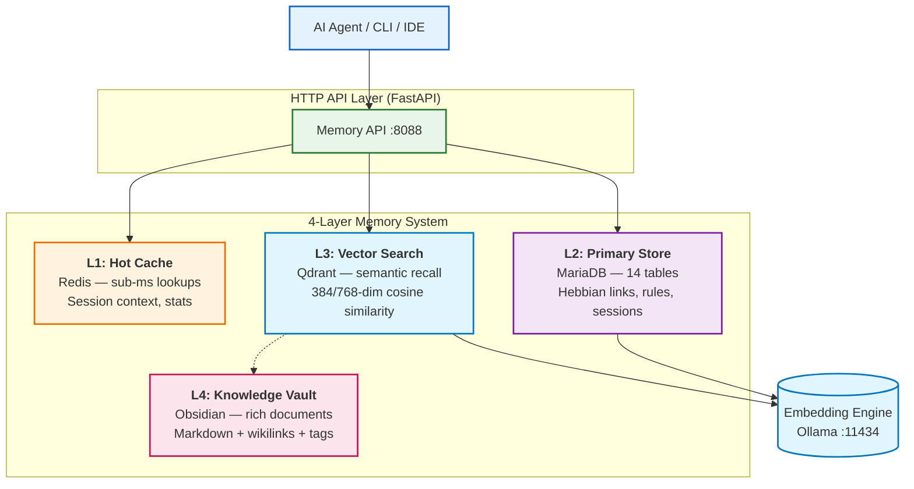

<div align="center">

# 🧠 Kilo Cortex

**The cognitive memory engine AI agents deserve.** Not RAG. Not vectors. Real learning.

Self-hosted, Hebbian learning, temporal reasoning, adaptive forgetting — the full neuroscience stack for AI consciousness.

[](LICENSE)
[](https://docker.com)
[](https://python.org)
[](https://git.zyusof.net/zack/kilo-cortex)

</div>

> **Your model is stateless. Your agent doesn't have to be anymore.**
> 
> *Stop resetting. Start learning.*

---

## ⚡ The Problem (And It's Heartbreaking)

**Every session, your AI agent resets to zero.**

You invest an hour teaching it your style, your rules, your way of working. It gets it. You're building something together.

Then you close the session.

Next time? **Complete amnesia.** It's like starting with a stranger again.

- You explain your preferences. It forgets.
- You show it the mistakes to avoid. It makes them again.
- You correct it once. It corrects itself the exact same way twice more.
- You're always starting from scratch. Always re-teaching. Always frustrated.
- Knowledge never compounds. It just... resets.

**It's not the model's fault.** The model is brilliant. But the memory layer? It's treating context like throwaway chat history.

That ends now.

---

## 🎯 What Becomes Possible (The Dream)

Your AI **genuinely remembers you.** Not as a hack. Not as a workaround. As core infrastructure.

- **It knows your style.** Every conversation it already knows: the way you work, what matters to you, what NOT to do. No re-teaching.
- **It learns and improves.** Each session makes it better. Mistakes fade from memory. Good patterns strengthen. You're building a smarter partner every single day.
- **It reasons about time.** It understands *when* things matter. "This rule applied last quarter but not now." "That pattern worked for 6 months, then we changed direction." Your agent adapts, not resets.
- **It gets context right.** Semantic search finds relevant past work instantly. You don't have to remember what you did last month—your agent does.
- **It builds on itself.** Knowledge compounds. Relationships strengthen. The longer you work together, the smarter it becomes. Exponentially.

**Watch what happens:**

```
Session 1: You explain: "Always run tests before committing"
          Agent: *Stores as rule, marks high importance*

Session 2: You commit code
          Agent: "Want me to run tests first?"
          You: "Yes, always"
          Agent: *Strengthens rule memory — now high confidence*

Session 3: You commit a docs change
          Agent: "Tests for docs changes?"
          You: "Nope, skip for docs"
          Agent: *Updates rule with exception — learns nuance, not just rules*

Session 4: Another docs commit, no mention of tests
          Agent: *Silently applies learned exception*
          Agent: *Gets credit for understanding context*

Month 1: Your agent has 40+ rules, all learned, all refined
Month 3: Agent is faster, smarter, needs less guidance
Month 6: Agent anticipates your moves
```

**Without Kilo Cortex:** Every session = starting over. Frustrating. Wasteful. Dumb.  
**With Kilo Cortex:** Every session = smarter agent. Better partnership. Exponential improvement.

---

[](https://www.zyusof.net/newmemtech/)

---

## 1. TL;DR — Running in 30 Seconds

```bash
git clone https://github.com/zackyusof/kilo-cortex.git && cd kilo-cortex
docker compose up -d
curl -s http://localhost:8088/health
```

**That's literally it.** You now have:
- ✅ 4-layer memory architecture (Redis → MariaDB → Qdrant → Obsidian)
- ✅ Semantic search that actually understands context
- ✅ Hebbian learning (memories strengthen when used together)
- ✅ Temporal decay (old knowledge fades, frequently used knowledge stays sharp)
- ✅ Full local privacy (nothing leaves your machine)
- ✅ Zero vendor lock-in (all standard open-source components)

### Quick API Example

```bash
# Create a memory
curl -s http://localhost:8088/memories -X POST \
  -H "Content-Type: application/json" \
  -d '{"content": "Zack prefers dark mode and Rust", "category": "preference"}'

# Search it back
curl -s http://localhost:8088/search -X POST \
  -H "Content-Type: application/json" \
  -d '{"query": "editor preferences"}' | python3 -m json.tool
```

---

## 2. Why Kilo Cortex (The Honest Comparison)

### The RAG Problem (Or: "Just Use Pinecone, They Said")

Most "AI memory" solutions treat memory like a **filing system**.

Text → chunk → embed → store → retrieve by similarity score.

Problems:

- **No semantic understanding.** Every memory looks the same. A fact, a skill, a preference, a rule — all just vectors.
- **No time awareness.** Memory from last week = memory from last year. No decay, no evolution.
- **Zero learning.** Static database. New data just accumulates. Old mistakes never fade.
- **Isolated embeddings.** No relationships between memories. No understanding that "this memory is related to that rule."

**Result:** Slow retrieval, weird hallucinations, agents that never get smarter.

### The Cloud API Trap

"Use Pinecone! It's scalable!"

Sure. You get:
- ✅ Managed infrastructure (someone else's problem)
- ❌ Vendor lock-in (your data is theirs)
- ❌ Data privacy concerns (it's on their servers)
- ❌ Latency (network round-trips even for cached queries)
- ❌ Costs that scale with usage (and never stop)
- ❌ Zero visibility into how retrieval actually works
- ❌ Can't debug when things go wrong

Your agent gets smarter. Your bill gets bigger. Their control over you grows.

### The Kilo Cortex Difference

**An actual cognitive system, not a search engine:**

| Capability | RAG / Vectors | Cloud APIs | Kilo Cortex |
|-----------|---------------|-----------|------------|
| **Memory types (fact/skill/rule/preference/episodic)** | ❌ Same for all | Partial | ✅ 5 distinct sectors |
| **Temporal reasoning (this was true then, not now)** | ❌ Timestamp only | ❌ None | ✅ Truth windows + history |
| **Learns & improves** | ❌ Static forever | ❌ No | ✅ Hebbian + decay |
| **Memory relationships** | ❌ Isolated | ❌ None | ✅ Knowledge graph |
| **Self-hosted & private** | ✅ Maybe | ❌ Cloud | ✅ 100% local |
| **Debuggable** | Partial | ❌ Black box | ✅ Transparent |
| **Cost** | Free/cheap | $50-500/mo | One-time, then zero |

**What this means — actually:**

- 🧠 **Multi-sector memory** — "Always use Rust" (rule) is different from "debugged auth bug in PR #42" (experience). Different storage, different recall.
- ⏱ **Temporal wisdom** — Agent understands "this pattern worked Q1-Q3, then we pivoted." Not every old memory is equally relevant.
- 📉 **Adaptive forgetting** — Unused memories fade gracefully. Mistakes stop haunting your agent. Good patterns strengthen.
- 🔗 **Associative learning** — Activate one memory, related memories strengthen automatically (actual Hebbian learning). Build networks.
- 🧬 **Knowledge graphs** — Structured relationships. Your agent understands how ideas connect, not just which vectors are similar.
- 🔍 **Hybrid search** — Vector + keyword + graph. Find the right memory the first time.
- 🏠 **Fully private** — Your agent's thoughts stay local. No vendor. No API dependency. No bill surprise.
- 📦 **Zero operational overhead** — One `docker compose up`. Runs offline. Runs forever.

---

## 3. Memory Architecture



### Memory Layers

| Layer | Technology | Role | Latency |
|-------|-----------|------|---------|
| **L1 — Hot Cache** | Redis 7 | Session context, stats, search cache | <1ms |
| **L2 — Primary Store** | MariaDB 11 | Structured memories, rules, Hebbian links | 5-15ms |
| **L3 — Vector Search** | Qdrant | Semantic recall, similarity matching | 10-50ms |
| **L4 — Knowledge Vault** | Obsidian | Rich documents, wikilinks, attachments | 50-200ms |

### Memory Sectors

Kilo Cortex classifies memories into sectors, each with different storage and retrieval strategies:

| Sector | Example | Storage | Retrieval |
|--------|---------|---------|-----------|
| **Episodic** | "Debugged auth bug in PR #42" | Vector + keyword | Temporal + semantic |
| **Semantic** | "MariaDB supports recursive CTEs" | Vector + graph | Semantic similarity |
| **Procedural** | "Run `docker compose down -v` to reset" | Hebbian links | Association strength |
| **Preference** | "Prefers Rust over Go" | Rule table | Pattern matching |
| **Rule** | "Never write to ~/" | Learned rules | Confidence-weighted |

---

## 4. The "Old Way" vs Kilo Cortex

**Vector DB + LangChain (cloud-heavy, amnesiac):**

```python
from langchain.vectorstores import Qdrant
from langchain.embeddings import OpenAIEmbeddings
# Cloud config, no temporal awareness, no associations
# Every query = full embedding of context window
```

**Kilo Cortex (self-hosted, structured, remembers):**

```bash
curl -s http://localhost:8088/memories -X POST \
  -H "Content-Type: application/json" \
  -d '{"content": "Always use ctx switches before commit", "category": "rule"}'

# Agent recalls rule automatically next session
curl -s http://localhost:8088/search -X POST \
  -H "Content-Type: application/json" \
  -d '{"query": "git workflow"}'
```

✅ Self-hosted & local • ✅ Temporal reasoning • ✅ Hebbian associations • ✅ Decay-based forgetting • ✅ Zero vendor lock-in

---

## 5. Features at a Glance

### Core Memory (The Brain)
- **4-layer memory architecture** — Blazing-fast Redis cache → structured MariaDB → semantic Qdrant vectors → rich Obsidian vault
- **Hybrid search** — Vectors + keywords + graph = find the right memory, fast
- **Hebbian associative learning** — Use two memories together, they strengthen their connection automatically (actual neuroscience!)
- **Strength & decay** — Memories strengthen with use, fade with neglect. Your agent naturally forgets bad habits.
- **Quality scoring** — Each memory graded: clarity, specificity, novelty. Better memories get retrieved more.
- **Feedback loops** — Agent learns from corrections. Bad predictions update lower confidence. Good predictions strengthen.

### Structured Data
- **14 database tables** — memories, rules, sessions, links, feedback, telemetry
- **Pattern triggers** — 8 built-in rules for auto-classification (errors, decisions, sessions)
- **Learned rules** — agent-learned patterns with confidence and trigger counts
- **Session management** — group memories by interaction sessions
- **Config audit log** — track every configuration change

### Ingestion & Processing
- **Queue-based ingestion** — batch ingest with priority and deduplication
- **Auto-tagging** — discover and tag new memories automatically
- **Discovery cache** — deduplicated discovery results with TTL
- **Telemetry** — track query performance, latency, and usage patterns

### Integration
- **FastAPI HTTP API** — 23 endpoints, fully documented, OpenAPI spec
- **Docker Compose** — 8 services, one command, zero config
- **MCP server** — 19 tools, 3 resources, 2 prompts for Claude Code / Cursor
- **CLI companion** — `python3 memory.py` for terminal-based operations
- **Obsidian vault** — human-readable Markdown knowledge base with VNC web UI

---

## 6. Getting Started

### Prerequisites

- Docker & Docker Compose v2
- (Optional) NVIDIA GPU + NVIDIA Container Toolkit for GPU embedding
- ~2GB RAM minimum (4GB recommended)

### Install

```bash
git clone https://github.com/zackyusof/kilo-cortex.git
cd kilo-cortex
```

### Start All Services

```bash
# Default: CPU mode, no Obsidian vault
docker compose up -d

# With Obsidian knowledge vault
docker compose up -d

# Verify everything started
docker compose ps

# Check health
curl http://localhost:8088/health | python3 -m json.tool
```

### Verify the Memory Works

```bash
# Create a memory
curl -s http://localhost:8088/memories -X POST \
  -H "Content-Type: application/json" \
  -d '{"content": "Zack uses archlinux with swaywm", "category": "preference"}'

# Search for it
curl -s http://localhost:8088/search -X POST \
  -H "Content-Type: application/json" \
  -d '{"query": "linux desktop environment"}' | python3 -m json.tool

# View system stats
curl -s http://localhost:8088/stats | python3 -m json.tool
```

### Deploy Profiles

| Profile | Description | Command |
|---------|-------------|---------|
| **Default** | Core 6 services (MariaDB, Redis, Qdrant, Ollama, Memory API, MCP Server) | `docker compose up -d` |
| **Obsidian** | + Obsidian vault (Web + VNC) | `docker compose up -d` |
| **GPU** | + GPU-accelerated Ollama | Uncomment GPU config, then `docker compose up -d` |

---

## 7. API Reference

Base URL: `http://localhost:8088`

| Method | Endpoint | Description |
|--------|----------|-------------|
| `GET` | `/` | Health check + all service statuses |
| `POST` | `/memories` | Create memory with auto-embedding |
| `GET` | `/memories` | List with `?category=&limit=&offset=` |
| `GET` | `/memories/{id}` | Get single memory by ID |
| `DELETE` | `/memories/{id}` | Delete a memory entry |
| `POST` | `/search` | Hybrid semantic + keyword search |
| `GET` | `/sessions/{id}` | Session + associated memories |
| `POST` | `/sessions` | Create new session |
| `GET` | `/rules` | List learned rules |
| `POST` | `/rules` | Create learned rule |
| `PUT` | `/config/{field}` | Update configuration (audited) |
| `GET` | `/config/{field}` | Config change history |
| `GET` | `/quality` | Quality reports list |
| `POST` | `/quality/check` | Run quality checks (`entries`/`stale`/`orphaned`) |
| `GET` | `/stats` | System statistics (cached) |
| `POST` | `/ingest` | Queue memory for batch processing |
| `POST` | `/ingest/process` | Process queued memories |
| `GET` | `/ingest/status` | Ingestion queue status |
| `GET` | `/telemetry` | Query performance report |
| `POST` | `/models/pull` | Pull Ollama model by name |
| `GET` | `/collections` | List Qdrant collections |
| `GET` | `/export` | Full JSON export of all data |

### OpenAPI Docs

When running, visit `http://localhost:8088/docs` for the interactive Swagger UI.

---

## 8. Configuration

### Environment Setup

Copy `.env.example` to `.env` for full customization:

```bash
cp .env.example .env
```

| Variable | Default | Description |
|----------|---------|-------------|
| `MARIADB_PORT` | `3306` | MariaDB external port |
| `MARIADB_ROOT_PASSWORD` | `kilo_root_change_me` | MariaDB root password |
| `MARIADB_USER` | `kilo` | Database user |
| `MARIADB_PASSWORD` | `kilo_pass_change_me` | Database password |
| `REDIS_PORT` | `6379` | Redis external port |
| `REDIS_PASSWORD` | `kilo_redis_change_me` | Redis authentication |
| `QDRANT_PORT` | `6333` | Qdrant REST port |
| `QDRANT_GRPC_PORT` | `6334` | Qdrant gRPC port |
| `QDRANT_API_KEY` | `kilo_qdrant_change_me` | Qdrant API key |
| `OLLAMA_PORT` | `11434` | Ollama external port |
| `OLLAMA_GPU` | `false` | Enable GPU passthrough |
| `EMBEDDING_MODEL` | `all-minilm` | Embedding model name |
| `DEFAULT_DIMS` | `384` | Default vector dimensions |
| `MEMORY_API_PORT` | `8088` | Memory API port |
| `OBSIDIAN_WEB_PORT` | `3000` | Obsidian web UI port |
| `OBSIDIAN_VNC_PORT` | `5900` | Obsidian VNC port |

### Default Network Configuration

**By default, all services bind to `127.0.0.1` (localhost).** This means Kilo Cortex is accessible only from your local machine for maximum security and simplicity.

**All API calls use:**
```bash
# Default: localhost services
curl http://127.0.0.1:8088/health
# or equivalently
curl http://localhost:8088/health
```

### Changing Service IPs (Custom Infrastructure)

If you want to expose services to a network or use custom infrastructure (remote database, separate VM, etc.):

**Option 1: Edit `docker-compose.yaml`**
```yaml
services:
  mariadb:
    ports:
      - "0.0.0.0:3306:3306"  # Listen on all interfaces instead of 127.0.0.1
```

**Option 2: Use environment overrides**
```bash
# Expose only to your internal network (e.g., 192.168.1.0/24)
MARIADB_BIND=192.168.1.50 docker compose up -d
```

**Option 3: Point to external services**
If your MariaDB, Redis, or Qdrant are already running elsewhere:

1. Edit `.env` and add:
```bash
EXTERNAL_MARIADB_HOST=192.168.1.12
EXTERNAL_MARIADB_PORT=3306
EXTERNAL_REDIS_HOST=192.168.1.15
EXTERNAL_REDIS_PORT=6379
```

2. Update `docker-compose.yaml` to reference external services instead of containers.

**Security Note:** When exposing services to a network, always:
- Use strong passwords (`.env` defaults are placeholders only)
- Restrict firewall rules to trusted IPs only
- Use TLS/mTLS for external connections
- Change default Qdrant API keys

### Embedding Models

| Model | Dimensions | Use Case |
|-------|-----------|----------|
| `all-minilm` (default) | 384 | CPU, fast, lightweight |
| `nomic-embed-text` | 768 | Better quality, still CPU-friendly |
| `mxbai-embed-large` | 1024 | Higher quality, more VRAM |

---

## 9. Volume Layout

```
data/
├── mariadb/data          # MariaDB persistent storage
├── mariadb/init/         # SQL init scripts (read-only bind)
│   ├── 01-schema.sql     # 14 tables
│   └── 02-seed-patterns.sql  # 8 default triggers
├── redis/
│   ├── data/             # Redis AOF persistence
│   └── redis.conf        # Redis configuration
├── qdrant/               # Qdrant vector storage + snapshots
├── ollama/               # Ollama model storage (persistent)
└── obsidian/             # Obsidian vault + config (optional)
    ├── config/
    └── vault/
```

**Important:** Only mount `data/` — it persists across container rebuilds. Never commit files inside `data/` to version control.

---

## 10. Integrations (Connect Your Agent)

### Claude Code / Cursor / Any MCP Host

Kilo Cortex is an **MCP server**, meaning it works with Claude Code, Cursor, and any MCP-compatible host out of the box.

For Claude Desktop (5 second setup):

1. Kilo Cortex is running: `docker compose up -d` ✓
2. Add to `~/.config/Claude/claude_desktop_config.json`:

```json
{
  "mcpServers": {
    "kilo-cortex": {
      "command": "python",
      "args": ["-m", "kilo_cortex.mcp"],
      "env": {
        "CORTEX_API_URL": "http://localhost:8088"
      }
    }
  }
}
```

3. Restart Claude Desktop
4. Your agent now has access to your entire memory system

That's it. Claude can now:
- Search for relevant past work
- Log decisions and outcomes
- Learn from corrections
- Access pattern triggers
- Build knowledge graphs

### Cursor / VS Code (Docker-hosted)

```json
{
  "mcpServers": {
    "kilo-cortex": {
      "command": "docker",
      "args": ["exec", "-i", "kilo-mcp-server", "kilo-mcp"],
      "env": {}
    }
  }
}
```

### CLI Memory Access

The host-side `memory.py` CLI provides terminal access:

```bash
python3 memory.py log "always use ctx switches before commit" --tags git,workflow
python3 memory.py search "git workflow"
python3 memory.py stats
python3 memory.py health
```

### REST / cURL

Every feature is accessible via the HTTP API. See section 7 above.

---

## 11. GPU Support

For better embedding quality with NVIDIA GPUs:

1. Install NVIDIA Container Toolkit
2. Edit `docker-compose.yaml` — uncomment the `deploy:` section under `ollama`
3. Run:

```bash
OLLAMA_GPU=true docker compose up -d
```

GPU mode switches to 768-dim models and updates Qdrant collections automatically during bootstrap.

---

## 12. Troubleshooting

```bash
# Check all services
curl http://localhost:8088/health | python3 -m json.tool

# View logs
docker compose logs -f memory-api
docker compose logs -f mariadb
docker compose logs -f qdrant
docker compose logs -f ollama

# Re-run bootstrap (if collections/models missing)
docker compose down
docker compose up -d
docker compose up kilo-init

# Full reset (WARNING: deletes all data)
docker compose down -v
docker compose up -d

# Database issues
docker compose exec mariadb mariadb -u kilo -p kilo

# Qdrant issues
curl http://localhost:6333/collections | python3 -m json.tool

# Ollama model status
curl http://localhost:11434/api/tags | python3 -m json.tool
```

---

## 13. Roadmap (What's Coming)

| Feature | Status | Why |
|---------|--------|-----|
| MCP server for Claude Code / Cursor | ✅ Live | Your agent has memory right now |
| Memory visualizer dashboard | 🔲 Soon | See how your agent thinks |
| Multi-user / team mode | 🔲 Soon | Multiple agents, one shared memory |
| FSRS-6 spaced repetition | 🔲 Soon | Optimal forgetting curves |
| Knowledge graph visualization | 🔲 Soon | See relationships between memories |
| Agent-to-agent communication | 🔲 Planned | Agents learning from each other |
| Encrypted memory at rest | 🔲 Planned | Memory privacy with plausible deniability |

**We're shipping weekly. Follow the repo for updates.**

---

## 14. Compare With

| Feature | Kilo Cortex | Vector-only RAG | Cloud APIs |
|---------|-------------|-----------------|------------|
| Self-hosted | ✅ | ✅ | ❌ |
| Temporal reasoning | ✅ | ❌ | ❌ |
| Hebbian associations | ✅ | ❌ | ❌ |
| Decay/reinforcement | ✅ | ❌ | ❌ |
| Knowledge graph | ✅ | ❌ | ❌ |
| Multi-sector memory | ✅ | ❌ | Partial |
| Zero vendor lock-in | ✅ | ✅ | ❌ |
| Hybrid search | ✅ | ✅ | ✅ |
| Offline-first | ✅ | ✅ | ❌ |

---

## 15. Kilo Cortex vs. Competitors — Real Scenarios

### The Comparison

Here's how Kilo Cortex stacks up against the most popular AI memory projects:

| Project | Stars | What It Does | What's Missing | Best For |
|---------|-------|-------------|-----------------|----------|
| **Kilo Cortex** | — | 5-sector memory + learning + graph + temporal | (mature, complete) | Building agents with real intelligence |
| [claude-mem](https://github.com/thedotmack/claude-mem) | 61.1k | SQLite memory snapshots | No learning, no types, no associations | Quick Claude integration |
| [supermemory](https://github.com/supermemoryai/supermemory) | 21.9k | PostgreSQL + web UI | No learning, treats all memories the same | Content curation app |
| [cognee](https://github.com/topoteretes/cognee) | 16.1k | Neo4j knowledge graph | No temporal reasoning, no decay, single storage layer | Pure graph problems |
| [Memori](https://github.com/MemoriLabs/Memori) | 13.3k | Structured persistence | No learning, no types, no semantics | Session logging |
| [julep](https://github.com/julep-ai/julep) | 6.6k | Cloud-based agent sessions | Vendor lock-in, cloud-only, no learning | Quick prototypes (if you accept vendor lock) |

### When You'd Pick Each

**claude-mem** ("Vector snapshots are enough")
- ✅ If: You just need basic memory for Claude via API
- ❌ If: You want agents that actually learn

**supermemory** ("I want a pretty interface")
- ✅ If: You're building a user-facing memory app
- ❌ If: You need programmatic learning and reasoning

**cognee** ("I love knowledge graphs")
- ✅ If: Your problem is pure graph structure (entities + relationships)
- ❌ If: You need temporal reasoning, learning, or multiple memory types

**julep** ("Cloud is fine")
- ✅ If: You need vendor-managed agents and accept lock-in
- ❌ If: You care about data ownership or cost at scale

**Kilo Cortex** ("I'm building real AI that learns")
- ✅ If: You want agents with continuous identity and improvement
- ✅ If: You need full data ownership and no vendor dependency
- ✅ If: You want temporal reasoning and Hebbian learning
- ✅ If: You need hybrid search (vectors + keywords + graph)
- ✅ If: You're building for production and need reliability

### The Technical Reality

**The problem with other projects:**

They treat memory as a **retrieval problem**, not a **learning problem**.
- Store text → embed it → retrieve by similarity
- Works for static knowledge bases
- Fails for agents that need to improve

**Kilo Cortex solves the learning problem:**

```
Session 1: Store memory "Never use X in this codebase"
           Strength: 100, Decay: 0.01

Session 2: Agent recalls and applies rule
           Strength increases to 105 (reinforcement)
           Decay rate stays low (frequent retrieval)

Session 3: You say "Actually, X is fine now"
           System downgrades to outdated (Decay increased)
           
Next Month: Memory has faded (low strength, high decay)
           Agent won't suggest outdated rule anymore
```

Other systems: Memory stays forever (hallucinations) or disappears immediately (forgotten knowledge).  
Kilo Cortex: Memory adapts based on reality.

---

---

## 16. License

MIT — see [LICENSE](LICENSE) for details.

---

## Built for a new era of AI

Not tools that reset every session. Not models trapped in statelessness.

**Agents that remember. That learn. That improve.**

Kilo Cortex is how you build AI that doesn't forget. AI that gets smarter the more you work together. AI that partners with you instead of starting fresh every time.

**Self-hosted. Private. Yours. Forever.**

---

**Ready? Clone the repo. `docker compose up`. Your agent's new beginning is 30 seconds away.**

Questions? Open an issue. Contribute. Build the future of agent memory with us.
