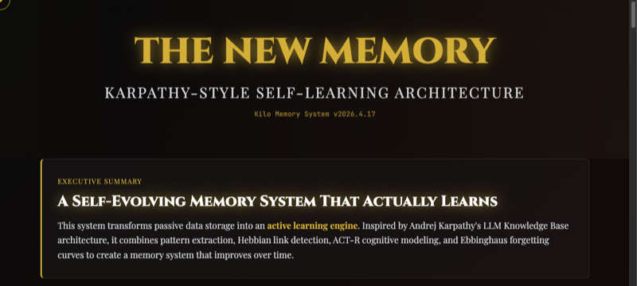
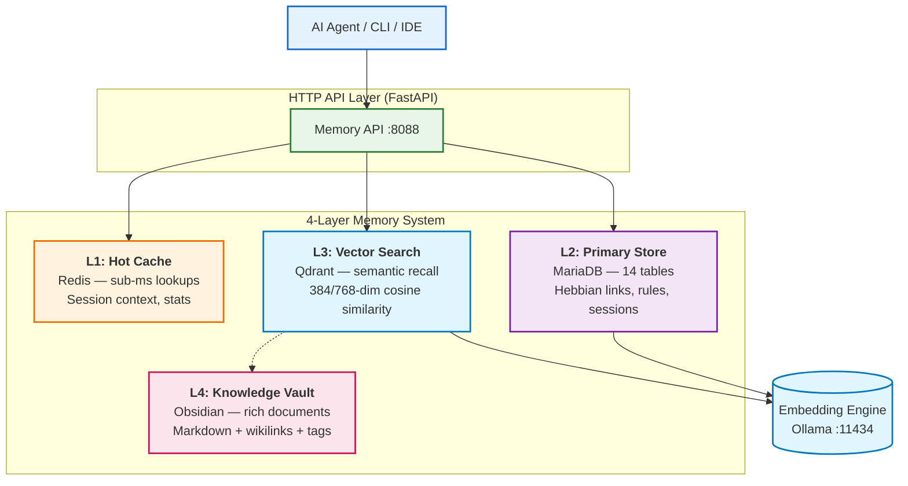

<div align="center">

# Kilo Cortex

**Self-hosted cognitive memory engine for AI agents.** Long-term memory with Hebbian learning, decay, and knowledge graphs — not just RAG.

[](LICENSE)
[](https://docker.com)
[](https://python.org)
[](https://git.zyusof.net/zack/kilo-cortex)

</div>

> Your model stays stateless. **Your agent stops being amnesiac.**

---

## ⚡ The Problem You Face Right Now

**Your AI agent forgets everything between sessions.**

- You explain your workflow preferences. Next session: forgotten.
- The agent repeats the same mistakes over and over.
- It never learns from past interactions or failures.
- Every conversation is treated as if it's starting fresh.
- You spend energy re-teaching it the same patterns.
- Your knowledge doesn't compound — it resets.

**This isn't a limitation of the model. It's a limitation of how you're storing context.**

---

## 🎯 What Becomes Possible With Kilo Cortex

Your AI gains **continuous identity and learning**:

- **It remembers who you are.** Your preferences, style, constraints — automatically recalled.
- **It learns from experience.** Patterns from past sessions inform future decisions.
- **It improves over time.** Each interaction strengthens useful memories, weakens outdated ones.
- **It knows what it knows.** Memories are tagged by type (fact, skill, preference, rule) so retrieval is precise.
- **It understands time.** "This was true 3 months ago, but not anymore" vs "this is always true."

**Real example workflow:**

```
Session 1: User explains "Always run tests before committing"
          Agent stores: RULE + triggers

Session 2: Agent suggests running tests before committing (remembered!)
          User confirms — memory strength increases

Session 3: User says "But skip tests for docs-only changes"
          Agent updates rule with exception, learns from feedback

Session 4: User commits docs change without tests
          Agent: "Should I run tests?" 
          User: "Nope, docs only"
          Agent learns the exception applies here too
```

**Without Kilo Cortex:** Every session restarts. Lost knowledge.  
**With Kilo Cortex:** Agent gets smarter every session.

---

[](https://www.zyusof.net/newmemtech/)

---

## 1. TL;DR — Use It in 10 Seconds

```bash
git clone https://git.zyusof.net/zack/kilo-cortex.git && cd kilo-cortex
docker compose up -d
curl -s http://localhost:8088/health
```

That's it. You now have a full memory backend with vector search, associative links, and decay-based forgetting.

### Quick API Example

```bash
# Create a memory
curl -s http://localhost:8088/memories -X POST \
  -H "Content-Type: application/json" \
  -d '{"content": "Zack prefers dark mode and Rust", "category": "preference"}'

# Search it back
curl -s http://localhost:8088/search -X POST \
  -H "Content-Type: application/json" \
  -d '{"query": "editor preferences"}' | python3 -m json.tool
```

---

## 2. Why Kilo Cortex (vs Everything Else)

### The RAG Problem

Most "AI memory" is just **vector similarity search**:
- Text gets chunked → embedded → stored → retrieved by similarity
- No understanding of **what kind** of memory (fact? skill? preference? rule?)
- No temporal awareness (everything from last month = everything from yesterday)
- No learning or forgetting (static database, not adaptive)
- No relationships between memories (isolated embeddings)

**Result:** Expensive retrieval, weak recall, zero learning.

### The Cloud API Problem

Managed memory services (Pinecone, Weaviate Cloud, etc.) add:
- Vendor lock-in (stuck if they change pricing or shut down)
- Latency (network round-trips even for cache hits)
- Privacy concerns (your data on their infrastructure)
- Opaque behavior (can't debug, can't optimize)
- Subscription costs that compound over time

### The Kilo Cortex Difference

**Not "just vectors." An actual memory system with learning:**

| Capability | RAG / Vectors | Cloud APIs | Kilo Cortex |
|-----------|---------------|-----------|------------|
| **Understands memory types** | ❌ One blob | Partial | ✅ 5 distinct sectors |
| **Temporal reasoning** | ❌ Timestamp only | ❌ None | ✅ Truth windows + history |
| **Learns over time** | ❌ Static | ❌ No | ✅ Hebbian + decay |
| **Associations between memories** | ❌ None | ❌ None | ✅ Knowledge graph |
| **Self-hosted** | ✅ Maybe | ❌ Cloud only | ✅ 100% local |
| **Deterministic, debuggable** | Partial | ❌ Opaque | ✅ Full transparency |
| **Cost** | Free / cheap | $50-500/mo | One-time setup, zero recurring |

**What this means in practice:**

- 🧠 **Multi-sector memory** — Facts, skills, preferences, rules, experiences stored differently
- ⏱ **Temporal awareness** — "This was true Q1, now obsolete" vs "always true"
- 📉 **Adaptive decay** — Unused memories fade; frequently retrieved memories strengthen
- 🔗 **Associative learning** — Related memories strengthen when co-activated (Hebbian learning)
- 🧬 **Knowledge graph** — Structured relationships between facts (not just embeddings)
- 🔍 **Hybrid search** — Vector + keyword + graph = better recall, less hallucination
- 🏠 **Self-hosted** — Your data stays local, no API dependencies
- 📦 **Plug-and-play** — One Docker command, everything works offline

---

## 3. Memory Architecture



### Memory Layers

| Layer | Technology | Role | Latency |
|-------|-----------|------|---------|
| **L1 — Hot Cache** | Redis 7 | Session context, stats, search cache | <1ms |
| **L2 — Primary Store** | MariaDB 11 | Structured memories, rules, Hebbian links | 5-15ms |
| **L3 — Vector Search** | Qdrant | Semantic recall, similarity matching | 10-50ms |
| **L4 — Knowledge Vault** | Obsidian | Rich documents, wikilinks, attachments | 50-200ms |

### Memory Sectors

Kilo Cortex classifies memories into sectors, each with different storage and retrieval strategies:

| Sector | Example | Storage | Retrieval |
|--------|---------|---------|-----------|
| **Episodic** | "Debugged auth bug in PR #42" | Vector + keyword | Temporal + semantic |
| **Semantic** | "MariaDB supports recursive CTEs" | Vector + graph | Semantic similarity |
| **Procedural** | "Run `docker compose down -v` to reset" | Hebbian links | Association strength |
| **Preference** | "Prefers Rust over Go" | Rule table | Pattern matching |
| **Rule** | "Never write to ~/" | Learned rules | Confidence-weighted |

---

## 4. The "Old Way" vs Kilo Cortex

**Vector DB + LangChain (cloud-heavy, amnesiac):**

```python
from langchain.vectorstores import Qdrant
from langchain.embeddings import OpenAIEmbeddings
# Cloud config, no temporal awareness, no associations
# Every query = full embedding of context window
```

**Kilo Cortex (self-hosted, structured, remembers):**

```bash
curl -s http://localhost:8088/memories -X POST \
  -H "Content-Type: application/json" \
  -d '{"content": "Always use ctx switches before commit", "category": "rule"}'

# Agent recalls rule automatically next session
curl -s http://localhost:8088/search -X POST \
  -H "Content-Type: application/json" \
  -d '{"query": "git workflow"}'
```

✅ Self-hosted & local • ✅ Temporal reasoning • ✅ Hebbian associations • ✅ Decay-based forgetting • ✅ Zero vendor lock-in

---

## 5. Features at a Glance

### Core Memory
- **4-layer memory architecture** — hot cache → structured store → vector recall → knowledge vault
- **Hybrid search** — vector embeddings + full-text keyword + graph traversal
- **Hebbian associative links** — coactivated memories strengthen automatically
- **Strength & decay model** — memories fade with disuse, strengthen with retrieval
- **Quality scoring** — auto-assessed clarity, specificity, novelty, relevance
- **Feedback loop** — user ratings reinforce or weaken memories

### Structured Data
- **14 database tables** — memories, rules, sessions, links, feedback, telemetry
- **Pattern triggers** — 8 built-in rules for auto-classification (errors, decisions, sessions)
- **Learned rules** — agent-learned patterns with confidence and trigger counts
- **Session management** — group memories by interaction sessions
- **Config audit log** — track every configuration change

### Ingestion & Processing
- **Queue-based ingestion** — batch ingest with priority and deduplication
- **Auto-tagging** — discover and tag new memories automatically
- **Discovery cache** — deduplicated discovery results with TTL
- **Telemetry** — track query performance, latency, and usage patterns

### Integration
- **FastAPI HTTP API** — 23 endpoints, fully documented, OpenAPI spec
- **Docker Compose** — 8 services, one command, zero config
- **MCP server** — 19 tools, 3 resources, 2 prompts for Claude Code / Cursor
- **CLI companion** — `python3 memory.py` for terminal-based operations
- **Obsidian vault** — human-readable Markdown knowledge base with VNC web UI

---

## 6. Getting Started

### Prerequisites

- Docker & Docker Compose v2
- (Optional) NVIDIA GPU + NVIDIA Container Toolkit for GPU embedding
- ~2GB RAM minimum (4GB recommended)

### Install

```bash
git clone https://git.zyusof.net/zack/kilo-cortex.git
cd kilo-cortex
```

### Start All Services

```bash
# Default: CPU mode, no Obsidian vault
docker compose up -d

# With Obsidian knowledge vault
docker compose up -d

# Verify everything started
docker compose ps

# Check health
curl http://localhost:8088/health | python3 -m json.tool
```

### Verify the Memory Works

```bash
# Create a memory
curl -s http://localhost:8088/memories -X POST \
  -H "Content-Type: application/json" \
  -d '{"content": "Zack uses archlinux with swaywm", "category": "preference"}'

# Search for it
curl -s http://localhost:8088/search -X POST \
  -H "Content-Type: application/json" \
  -d '{"query": "linux desktop environment"}' | python3 -m json.tool

# View system stats
curl -s http://localhost:8088/stats | python3 -m json.tool
```

### Deploy Profiles

| Profile | Description | Command |
|---------|-------------|---------|
| **Default** | Core 6 services (MariaDB, Redis, Qdrant, Ollama, Memory API, MCP Server) | `docker compose up -d` |
| **Obsidian** | + Obsidian vault (Web + VNC) | `docker compose up -d` |
| **GPU** | + GPU-accelerated Ollama | Uncomment GPU config, then `docker compose up -d` |

---

## 7. API Reference

Base URL: `http://localhost:8088`

| Method | Endpoint | Description |
|--------|----------|-------------|
| `GET` | `/` | Health check + all service statuses |
| `POST` | `/memories` | Create memory with auto-embedding |
| `GET` | `/memories` | List with `?category=&limit=&offset=` |
| `GET` | `/memories/{id}` | Get single memory by ID |
| `DELETE` | `/memories/{id}` | Delete a memory entry |
| `POST` | `/search` | Hybrid semantic + keyword search |
| `GET` | `/sessions/{id}` | Session + associated memories |
| `POST` | `/sessions` | Create new session |
| `GET` | `/rules` | List learned rules |
| `POST` | `/rules` | Create learned rule |
| `PUT` | `/config/{field}` | Update configuration (audited) |
| `GET` | `/config/{field}` | Config change history |
| `GET` | `/quality` | Quality reports list |
| `POST` | `/quality/check` | Run quality checks (`entries`/`stale`/`orphaned`) |
| `GET` | `/stats` | System statistics (cached) |
| `POST` | `/ingest` | Queue memory for batch processing |
| `POST` | `/ingest/process` | Process queued memories |
| `GET` | `/ingest/status` | Ingestion queue status |
| `GET` | `/telemetry` | Query performance report |
| `POST` | `/models/pull` | Pull Ollama model by name |
| `GET` | `/collections` | List Qdrant collections |
| `GET` | `/export` | Full JSON export of all data |

### OpenAPI Docs

When running, visit `http://localhost:8088/docs` for the interactive Swagger UI.

---

## 8. Configuration

Copy `.env.example` to `.env` for full customization:

```bash
cp .env.example .env
```

| Variable | Default | Description |
|----------|---------|-------------|
| `MARIADB_PORT` | `3306` | MariaDB external port |
| `MARIADB_ROOT_PASSWORD` | `kilo_root_change_me` | MariaDB root password |
| `MARIADB_USER` | `kilo` | Database user |
| `MARIADB_PASSWORD` | `kilo_pass_change_me` | Database password |
| `REDIS_PORT` | `6379` | Redis external port |
| `REDIS_PASSWORD` | `kilo_redis_change_me` | Redis authentication |
| `QDRANT_PORT` | `6333` | Qdrant REST port |
| `QDRANT_GRPC_PORT` | `6334` | Qdrant gRPC port |
| `QDRANT_API_KEY` | `kilo_qdrant_change_me` | Qdrant API key |
| `OLLAMA_PORT` | `11434` | Ollama external port |
| `OLLAMA_GPU` | `false` | Enable GPU passthrough |
| `EMBEDDING_MODEL` | `all-minilm` | Embedding model name |
| `DEFAULT_DIMS` | `384` | Default vector dimensions |
| `MEMORY_API_PORT` | `8088` | Memory API port |
| `OBSIDIAN_WEB_PORT` | `3000` | Obsidian web UI port |
| `OBSIDIAN_VNC_PORT` | `5900` | Obsidian VNC port |

### Embedding Models

| Model | Dimensions | Use Case |
|-------|-----------|----------|
| `all-minilm` (default) | 384 | CPU, fast, lightweight |
| `nomic-embed-text` | 768 | Better quality, still CPU-friendly |
| `mxbai-embed-large` | 1024 | Higher quality, more VRAM |

---

## 9. Volume Layout

```
data/
├── mariadb/data          # MariaDB persistent storage
├── mariadb/init/         # SQL init scripts (read-only bind)
│   ├── 01-schema.sql     # 14 tables
│   └── 02-seed-patterns.sql  # 8 default triggers
├── redis/
│   ├── data/             # Redis AOF persistence
│   └── redis.conf        # Redis configuration
├── qdrant/               # Qdrant vector storage + snapshots
├── ollama/               # Ollama model storage (persistent)
└── obsidian/             # Obsidian vault + config (optional)
    ├── config/
    └── vault/
```

**Important:** Only mount `data/` — it persists across container rebuilds. Never commit files inside `data/` to version control.

---

## 10. Integrations

### Claude Code / Cursor / MCP Hosts

The MCP server is built into the Docker Compose stack. Run it standalone for local development:

```bash
# Local dev — stdio mode (for any MCP-compatible host)
cd mcp-server && pip install -e .
kilo-mcp
```

For Claude Desktop, add to `claude_desktop_config.json`:

```json
{
  "mcpServers": {
    "kilo-cortex": {
      "command": "kilo-mcp",
      "env": {
        "CORTEX_API_URL": "http://localhost:8088"
      }
    }
  }
}
```

### Cursor / VS Code (Docker-hosted)

```json
{
  "mcpServers": {
    "kilo-cortex": {
      "command": "docker",
      "args": ["exec", "-i", "kilo-mcp-server", "kilo-mcp"],
      "env": {}
    }
  }
}
```

### CLI Memory Access

The host-side `memory.py` CLI provides terminal access:

```bash
python3 memory.py log "always use ctx switches before commit" --tags git,workflow
python3 memory.py search "git workflow"
python3 memory.py stats
python3 memory.py health
```

### REST / cURL

Every feature is accessible via the HTTP API. See section 7 above.

---

## 11. GPU Support

For better embedding quality with NVIDIA GPUs:

1. Install NVIDIA Container Toolkit
2. Edit `docker-compose.yaml` — uncomment the `deploy:` section under `ollama`
3. Run:

```bash
OLLAMA_GPU=true docker compose up -d
```

GPU mode switches to 768-dim models and updates Qdrant collections automatically during bootstrap.

---

## 12. Troubleshooting

```bash
# Check all services
curl http://localhost:8088/health | python3 -m json.tool

# View logs
docker compose logs -f memory-api
docker compose logs -f mariadb
docker compose logs -f qdrant
docker compose logs -f ollama

# Re-run bootstrap (if collections/models missing)
docker compose down
docker compose up -d
docker compose up kilo-init

# Full reset (WARNING: deletes all data)
docker compose down -v
docker compose up -d

# Database issues
docker compose exec mariadb mariadb -u kilo -p kilo

# Qdrant issues
curl http://localhost:6333/collections | python3 -m json.tool

# Ollama model status
curl http://localhost:11434/api/tags | python3 -m json.tool
```

---

## 13. Roadmap

| Feature | Status |
|---------|--------|
| MCP server for Claude Code / Cursor | ✅ Done |
| Memory visualizer dashboard | 🔲 Planned |
| Multi-user / tenant isolation | 🔲 Planned |
| FSRS-6 spaced repetition | 🔲 Planned |
| Knowledge graph visualization | 🔲 Planned |
| Agent-to-agent messaging | 🔲 Planned |
| Encrypted memory at rest | 🔲 Planned |

---

## 14. Compare With

| Feature | Kilo Cortex | Vector-only RAG | Cloud APIs |
|---------|-------------|-----------------|------------|
| Self-hosted | ✅ | ✅ | ❌ |
| Temporal reasoning | ✅ | ❌ | ❌ |
| Hebbian associations | ✅ | ❌ | ❌ |
| Decay/reinforcement | ✅ | ❌ | ❌ |
| Knowledge graph | ✅ | ❌ | ❌ |
| Multi-sector memory | ✅ | ❌ | Partial |
| Zero vendor lock-in | ✅ | ✅ | ❌ |
| Hybrid search | ✅ | ✅ | ✅ |
| Offline-first | ✅ | ✅ | ❌ |

---

## 15. Kilo Cortex vs. Competitors — Real Scenarios

### The Comparison

Here's how Kilo Cortex stacks up against the most popular AI memory projects:

| Project | Stars | What It Does | What's Missing | Best For |
|---------|-------|-------------|-----------------|----------|
| **Kilo Cortex** | — | 5-sector memory + learning + graph + temporal | (mature, complete) | Building agents with real intelligence |
| [claude-mem](https://github.com/thedotmack/claude-mem) | 61.1k | SQLite memory snapshots | No learning, no types, no associations | Quick Claude integration |
| [supermemory](https://github.com/supermemoryai/supermemory) | 21.9k | PostgreSQL + web UI | No learning, treats all memories the same | Content curation app |
| [cognee](https://github.com/topoteretes/cognee) | 16.1k | Neo4j knowledge graph | No temporal reasoning, no decay, single storage layer | Pure graph problems |
| [Memori](https://github.com/MemoriLabs/Memori) | 13.3k | Structured persistence | No learning, no types, no semantics | Session logging |
| [julep](https://github.com/julep-ai/julep) | 6.6k | Cloud-based agent sessions | Vendor lock-in, cloud-only, no learning | Quick prototypes (if you accept vendor lock) |

### When You'd Pick Each

**claude-mem** ("Vector snapshots are enough")
- ✅ If: You just need basic memory for Claude via API
- ❌ If: You want agents that actually learn

**supermemory** ("I want a pretty interface")
- ✅ If: You're building a user-facing memory app
- ❌ If: You need programmatic learning and reasoning

**cognee** ("I love knowledge graphs")
- ✅ If: Your problem is pure graph structure (entities + relationships)
- ❌ If: You need temporal reasoning, learning, or multiple memory types

**julep** ("Cloud is fine")
- ✅ If: You need vendor-managed agents and accept lock-in
- ❌ If: You care about data ownership or cost at scale

**Kilo Cortex** ("I'm building real AI that learns")
- ✅ If: You want agents with continuous identity and improvement
- ✅ If: You need full data ownership and no vendor dependency
- ✅ If: You want temporal reasoning and Hebbian learning
- ✅ If: You need hybrid search (vectors + keywords + graph)
- ✅ If: You're building for production and need reliability

### The Technical Reality

**The problem with other projects:**

They treat memory as a **retrieval problem**, not a **learning problem**.
- Store text → embed it → retrieve by similarity
- Works for static knowledge bases
- Fails for agents that need to improve

**Kilo Cortex solves the learning problem:**

```
Session 1: Store memory "Never use X in this codebase"
           Strength: 100, Decay: 0.01

Session 2: Agent recalls and applies rule
           Strength increases to 105 (reinforcement)
           Decay rate stays low (frequent retrieval)

Session 3: You say "Actually, X is fine now"
           System downgrades to outdated (Decay increased)
           
Next Month: Memory has faded (low strength, high decay)
           Agent won't suggest outdated rule anymore
```

Other systems: Memory stays forever (hallucinations) or disappears immediately (forgotten knowledge).  
Kilo Cortex: Memory adapts based on reality.

---

---

## 16. License

MIT — see [LICENSE](LICENSE) for details.

---

**Built for agents that need to remember.**
**Self-hosted. Private. Yours.**
