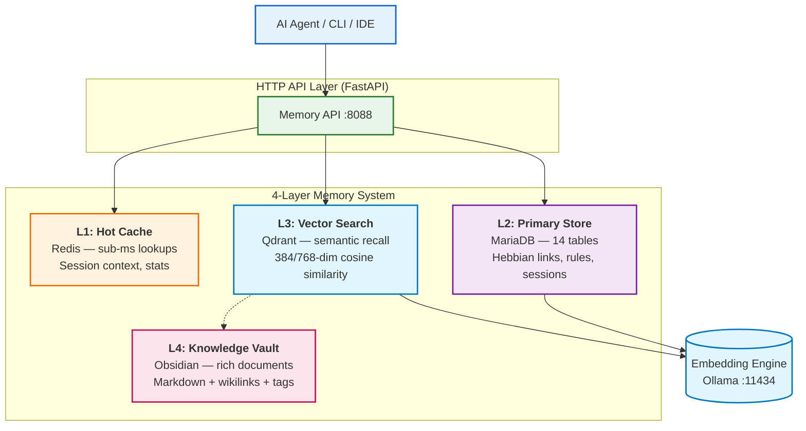

<div align="center">

# Kilo Cortex

**Self-hosted cognitive memory engine for AI agents.** Long-term memory with Hebbian learning, decay, and knowledge graphs — not just RAG.

[](LICENSE)
[](https://docker.com)
[](https://python.org)
[](https://git.zyusof.net/zack/kilo-cortex)

</div>

> Your model stays stateless. **Your agent stops being amnesiac.**

---

## 1. TL;DR — Use It in 10 Seconds

```bash
git clone https://git.zyusof.net/zack/kilo-cortex.git && cd kilo-cortex
docker compose up -d
curl -s http://localhost:8088/health
```

That's it. You now have a full memory backend with vector search, associative links, and decay-based forgetting.

### Quick API Example

```bash
# Create a memory
curl -s http://localhost:8088/memories -X POST \
  -H "Content-Type: application/json" \
  -d '{"content": "Zack prefers dark mode and Rust", "category": "preference"}'

# Search it back
curl -s http://localhost:8088/search -X POST \
  -H "Content-Type: application/json" \
  -d '{"query": "editor preferences"}' | python3 -m json.tool
```

---

## 2. Why Kilo Cortex (vs RAG, vs "just vectors")

Most "AI memory" is really just **RAG pipelines**:

- text is chunked → embedded → stored in a vector DB → retrieved by similarity
- They don't understand **facts vs events vs preferences vs skills**
- No temporal reasoning — everything from last week has the same weight as yesterday
- No decay or reinforcement — memories don't fade or strengthen over time
- No associations — there's no graph of how memories connect

**Cloud memory APIs add**: vendor lock-in, latency, opaque behavior, privacy problems.

**Kilo Cortex gives you an actual memory system:**

- 🧠 **Multi-sector memory** — episodic, semantic, procedural, preference, rule
- ⏱ **Temporal knowledge** — `valid_from`/`valid_to` truth windows, point-in-time queries
- 📉 **Decay & reinforcement** — adaptive forgetting instead of hard TTLs
- 🔗 **Hebbian associative links** — coactivated memories strengthen over time
- 🧬 **Knowledge graph** — structured relationships between facts
- 🔍 **Hybrid search** — vector + keyword + graph traversal
- 🏠 **Self-hosted, local-first** — you own the DB, you control the data
- 📦 **Plug-and-play Docker** — one command, everything runs

---

## 3. Memory Architecture



### Memory Layers

| Layer | Technology | Role | Latency |
|-------|-----------|------|---------|
| **L1 — Hot Cache** | Redis 7 | Session context, stats, search cache | <1ms |
| **L2 — Primary Store** | MariaDB 11 | Structured memories, rules, Hebbian links | 5-15ms |
| **L3 — Vector Search** | Qdrant | Semantic recall, similarity matching | 10-50ms |
| **L4 — Knowledge Vault** | Obsidian | Rich documents, wikilinks, attachments | 50-200ms |

### Memory Sectors

Kilo Cortex classifies memories into sectors, each with different storage and retrieval strategies:

| Sector | Example | Storage | Retrieval |
|--------|---------|---------|-----------|
| **Episodic** | "Debugged auth bug in PR #42" | Vector + keyword | Temporal + semantic |
| **Semantic** | "MariaDB supports recursive CTEs" | Vector + graph | Semantic similarity |
| **Procedural** | "Run `docker compose down -v` to reset" | Hebbian links | Association strength |
| **Preference** | "Prefers Rust over Go" | Rule table | Pattern matching |
| **Rule** | "Never write to ~/" | Learned rules | Confidence-weighted |

---

## 4. The "Old Way" vs Kilo Cortex

**Vector DB + LangChain (cloud-heavy, amnesiac):**

```python
from langchain.vectorstores import Qdrant
from langchain.embeddings import OpenAIEmbeddings
# Cloud config, no temporal awareness, no associations
# Every query = full embedding of context window
```

**Kilo Cortex (self-hosted, structured, remembers):**

```bash
curl -s http://localhost:8088/memories -X POST \
  -H "Content-Type: application/json" \
  -d '{"content": "Always use ctx switches before commit", "category": "rule"}'

# Agent recalls rule automatically next session
curl -s http://localhost:8088/search -X POST \
  -H "Content-Type: application/json" \
  -d '{"query": "git workflow"}'
```

✅ Self-hosted & local • ✅ Temporal reasoning • ✅ Hebbian associations • ✅ Decay-based forgetting • ✅ Zero vendor lock-in

---

## 5. Features at a Glance

### Core Memory
- **4-layer memory architecture** — hot cache → structured store → vector recall → knowledge vault
- **Hybrid search** — vector embeddings + full-text keyword + graph traversal
- **Hebbian associative links** — coactivated memories strengthen automatically
- **Strength & decay model** — memories fade with disuse, strengthen with retrieval
- **Quality scoring** — auto-assessed clarity, specificity, novelty, relevance
- **Feedback loop** — user ratings reinforce or weaken memories

### Structured Data
- **14 database tables** — memories, rules, sessions, links, feedback, telemetry
- **Pattern triggers** — 8 built-in rules for auto-classification (errors, decisions, sessions)
- **Learned rules** — agent-learned patterns with confidence and trigger counts
- **Session management** — group memories by interaction sessions
- **Config audit log** — track every configuration change

### Ingestion & Processing
- **Queue-based ingestion** — batch ingest with priority and deduplication
- **Auto-tagging** — discover and tag new memories automatically
- **Discovery cache** — deduplicated discovery results with TTL
- **Telemetry** — track query performance, latency, and usage patterns

### Integration
- **FastAPI HTTP API** — 23 endpoints, fully documented, OpenAPI spec
- **Docker Compose** — 7 services, one command, zero config
- **CLI companion** — `python3 memory.py` for terminal-based operations
- **MCP-ready** — designed for integration with Claude Code, Cursor, Codex, VS Code
- **Obsidian vault** — human-readable Markdown knowledge base with VNC web UI

---

## 6. Getting Started

### Prerequisites

- Docker & Docker Compose v2
- (Optional) NVIDIA GPU + NVIDIA Container Toolkit for GPU embedding
- ~2GB RAM minimum (4GB recommended)

### Install

```bash
git clone https://git.zyusof.net/zack/kilo-cortex.git
cd kilo-cortex
```

### Start All Services

```bash
# Default: CPU mode, no Obsidian vault
docker compose up -d

# With Obsidian knowledge vault
docker compose up -d

# Verify everything started
docker compose ps

# Check health
curl http://localhost:8088/health | python3 -m json.tool
```

### Verify the Memory Works

```bash
# Create a memory
curl -s http://localhost:8088/memories -X POST \
  -H "Content-Type: application/json" \
  -d '{"content": "Zack uses archlinux with swaywm", "category": "preference"}'

# Search for it
curl -s http://localhost:8088/search -X POST \
  -H "Content-Type: application/json" \
  -d '{"query": "linux desktop environment"}' | python3 -m json.tool

# View system stats
curl -s http://localhost:8088/stats | python3 -m json.tool
```

### Deploy Profiles

| Profile | Description | Command |
|---------|-------------|---------|
| **Default** | Core 5 services (MariaDB, Redis, Qdrant, Ollama, Memory API) | `docker compose up -d` |
| **Obsidian** | + Obsidian vault (Web + VNC) | `docker compose up -d` |
| **GPU** | + GPU-accelerated Ollama | Uncomment GPU config, then `docker compose up -d` |

---

## 7. API Reference

Base URL: `http://localhost:8088`

| Method | Endpoint | Description |
|--------|----------|-------------|
| `GET` | `/` | Health check + all service statuses |
| `POST` | `/memories` | Create memory with auto-embedding |
| `GET` | `/memories` | List with `?category=&limit=&offset=` |
| `GET` | `/memories/{id}` | Get single memory by ID |
| `DELETE` | `/memories/{id}` | Delete a memory entry |
| `POST` | `/search` | Hybrid semantic + keyword search |
| `GET` | `/sessions/{id}` | Session + associated memories |
| `POST` | `/sessions` | Create new session |
| `GET` | `/rules` | List learned rules |
| `POST` | `/rules` | Create learned rule |
| `PUT` | `/config/{field}` | Update configuration (audited) |
| `GET` | `/config/{field}` | Config change history |
| `GET` | `/quality` | Quality reports list |
| `POST` | `/quality/check` | Run quality checks (`entries`/`stale`/`orphaned`) |
| `GET` | `/stats` | System statistics (cached) |
| `POST` | `/ingest` | Queue memory for batch processing |
| `POST` | `/ingest/process` | Process queued memories |
| `GET` | `/ingest/status` | Ingestion queue status |
| `GET` | `/telemetry` | Query performance report |
| `POST` | `/models/pull` | Pull Ollama model by name |
| `GET` | `/collections` | List Qdrant collections |
| `GET` | `/export` | Full JSON export of all data |

### OpenAPI Docs

When running, visit `http://localhost:8088/docs` for the interactive Swagger UI.

---

## 8. Configuration

Copy `.env.example` to `.env` for full customization:

```bash
cp .env.example .env
```

| Variable | Default | Description |
|----------|---------|-------------|
| `MARIADB_PORT` | `3306` | MariaDB external port |
| `MARIADB_ROOT_PASSWORD` | `kilo_root_change_me` | MariaDB root password |
| `MARIADB_USER` | `kilo` | Database user |
| `MARIADB_PASSWORD` | `kilo_pass_change_me` | Database password |
| `REDIS_PORT` | `6379` | Redis external port |
| `REDIS_PASSWORD` | `kilo_redis_change_me` | Redis authentication |
| `QDRANT_PORT` | `6333` | Qdrant REST port |
| `QDRANT_GRPC_PORT` | `6334` | Qdrant gRPC port |
| `QDRANT_API_KEY` | `kilo_qdrant_change_me` | Qdrant API key |
| `OLLAMA_PORT` | `11434` | Ollama external port |
| `OLLAMA_GPU` | `false` | Enable GPU passthrough |
| `EMBEDDING_MODEL` | `all-minilm` | Embedding model name |
| `DEFAULT_DIMS` | `384` | Default vector dimensions |
| `MEMORY_API_PORT` | `8088` | Memory API port |
| `OBSIDIAN_WEB_PORT` | `3000` | Obsidian web UI port |
| `OBSIDIAN_VNC_PORT` | `5900` | Obsidian VNC port |

### Embedding Models

| Model | Dimensions | Use Case |
|-------|-----------|----------|
| `all-minilm` (default) | 384 | CPU, fast, lightweight |
| `nomic-embed-text` | 768 | Better quality, still CPU-friendly |
| `mxbai-embed-large` | 1024 | Higher quality, more VRAM |

---

## 9. Volume Layout

```
data/
├── mariadb/data          # MariaDB persistent storage
├── mariadb/init/         # SQL init scripts (read-only bind)
│   ├── 01-schema.sql     # 14 tables
│   └── 02-seed-patterns.sql  # 8 default triggers
├── redis/
│   ├── data/             # Redis AOF persistence
│   └── redis.conf        # Redis configuration
├── qdrant/               # Qdrant vector storage + snapshots
├── ollama/               # Ollama model storage (persistent)
└── obsidian/             # Obsidian vault + config (optional)
    ├── config/
    └── vault/
```

**Important:** Only mount `data/` — it persists across container rebuilds. Never commit files inside `data/` to version control.

---

## 10. Integrations

### Claude Code

Connect via MCP (coming soon):

```bash
# Future: claude mcp add --transport http kilo-cortex http://localhost:8088/mcp
```

### Cursor / VS Code

Connect via MCP config:

```json
{
  "mcpServers": {
    "kilo-memory": {
      "type": "http",
      "url": "http://localhost:8088/mcp"
    }
  }
}
```

### CLI Memory Access

The host-side `memory.py` CLI provides terminal access:

```bash
python3 memory.py log "always use ctx switches before commit" --tags git,workflow
python3 memory.py search "git workflow"
python3 memory.py stats
python3 memory.py health
```

### REST / cURL

Every feature is accessible via the HTTP API. See section 7 above.

---

## 11. GPU Support

For better embedding quality with NVIDIA GPUs:

1. Install NVIDIA Container Toolkit
2. Edit `docker-compose.yaml` — uncomment the `deploy:` section under `ollama`
3. Run:

```bash
OLLAMA_GPU=true docker compose up -d
```

GPU mode switches to 768-dim models and updates Qdrant collections automatically during bootstrap.

---

## 12. Troubleshooting

```bash
# Check all services
curl http://localhost:8088/health | python3 -m json.tool

# View logs
docker compose logs -f memory-api
docker compose logs -f mariadb
docker compose logs -f qdrant
docker compose logs -f ollama

# Re-run bootstrap (if collections/models missing)
docker compose down
docker compose up -d
docker compose up kilo-init

# Full reset (WARNING: deletes all data)
docker compose down -v
docker compose up -d

# Database issues
docker compose exec mariadb mariadb -u kilo -p kilo

# Qdrant issues
curl http://localhost:6333/collections | python3 -m json.tool

# Ollama model status
curl http://localhost:11434/api/tags | python3 -m json.tool
```

---

## 13. Roadmap

| Feature | Status |
|---------|--------|
| MCP server for Claude Code / Cursor | 🔲 Planned |
| Memory visualizer dashboard | 🔲 Planned |
| Multi-user / tenant isolation | 🔲 Planned |
| FSRS-6 spaced repetition | 🔲 Planned |
| Knowledge graph visualization | 🔲 Planned |
| Agent-to-agent messaging | 🔲 Planned |
| Encrypted memory at rest | 🔲 Planned |

---

## 14. Compare With

| Feature | Kilo Cortex | Vector-only RAG | Cloud APIs |
|---------|-------------|-----------------|------------|
| Self-hosted | ✅ | ✅ | ❌ |
| Temporal reasoning | ✅ | ❌ | ❌ |
| Hebbian associations | ✅ | ❌ | ❌ |
| Decay/reinforcement | ✅ | ❌ | ❌ |
| Knowledge graph | ✅ | ❌ | ❌ |
| Multi-sector memory | ✅ | ❌ | Partial |
| Zero vendor lock-in | ✅ | ✅ | ❌ |
| Hybrid search | ✅ | ✅ | ✅ |
| Offline-first | ✅ | ✅ | ❌ |

---

### Kilo Cortex vs. the Field

Here's how Kilo Cortex stacks up against the most popular AI memory projects on GitHub:

| Project | ⭐ | Storage | Graph | Memory Model | Self-hosted | Multi-layer | Decay/Forgetting |
|---------|------|---------|-------|--------------|-------------|-------------|------------------|
| **Kilo Cortex** | — | MariaDB + Redis + Qdrant + Obsidian | ✅ Hebbian + knowledge graph | **5 sectors** (episodic, semantic, procedural, preference, rule) + temporal | ✅ | ✅ 4 layers | ✅ Adaptive decay |
| [claude-mem](https://github.com/thedotmack/claude-mem) | 61.1k | SQLite | ❌ | Single flat store | ✅ | ❌ Single | ❌ |
| [supermemory](https://github.com/supermemoryai/supermemory) | 21.9k | PostgreSQL | ❌ | Flat memory + app | ✅ | ❌ Single | ❌ |
| [cognee](https://github.com/topoteretes/cognee) | 16.1k | Neo4j | ✅ Knowledge graph | Knowledge engine | ✅ | ❌ Single | ❌ |
| [Memori](https://github.com/MemoriLabs/Memori) | 13.3k | Custom | ❌ | Structured persistence | ✅ | ❌ Single | ❌ |
| [julep](https://github.com/julep-ai/julep) | 6.6k | Serverless | ❌ | Session-based | ❌ (cloud) | ❌ Single | ❌ |
| [OpenMemory](https://github.com/CaviraOSS/OpenMemory) | 4k | Local file | ❌ | Flat store | ✅ | ❌ Single | ❌ |
| [memobase](https://github.com/memodb-io/memobase) | 2.7k | Custom | ❌ | User profile | ✅ | ❌ Single | ❌ |
| [memohai/Memoh](https://github.com/memohai/Memoh) | 1.5k | Custom | ❌ | Agent sessions | ✅ | ❌ Single | ❌ |

### What Makes Kilo Cortex Different

Most AI memory projects do **one thing**: vector search (claude-mem, OpenMemory), graph storage (cognee), or session tracking (julep, memobase). They share a common blind spot — they store memories as flat embeddings without understanding **what kind of memory** they're handling.

**Kilo Cortex is different because:**

| Dimension | Others | Kilo Cortex |
|-----------|--------|-------------|
| **Memory types** | Treated as one blob | 5 distinct sectors with different strategies |
| **Temporal reasoning** | Timestamps only | Truth windows + point-in-time queries |
| **Associations** | None or basic graph | Hebbian learning (strengthening through co-activation) |
| **Forgetting** | Hard TTL or none | Adaptive decay based on retrieval frequency |
| **Architecture** | Single store | 4-layer cascade (cache → structured → vector → vault) |
| **Data ownership** | Partially cloud-dependent | Fully self-hosted, 100% local |
| **Knowledge base** | Embedded vectors only | Obsidian vault with human-readable Markdown |

---

## 15. Live Demo

Embeds the running The New Memory architecture page for a real-time preview:

<iframe src="https://www.zyusof.net/newmemtech/" width="100%" height="800" style="border:none; border-radius:8px; margin:16px 0;"></iframe>

---

## 16. License

MIT — see [LICENSE](LICENSE) for details.

---

**Built for agents that need to remember.**
**Self-hosted. Private. Yours.**
